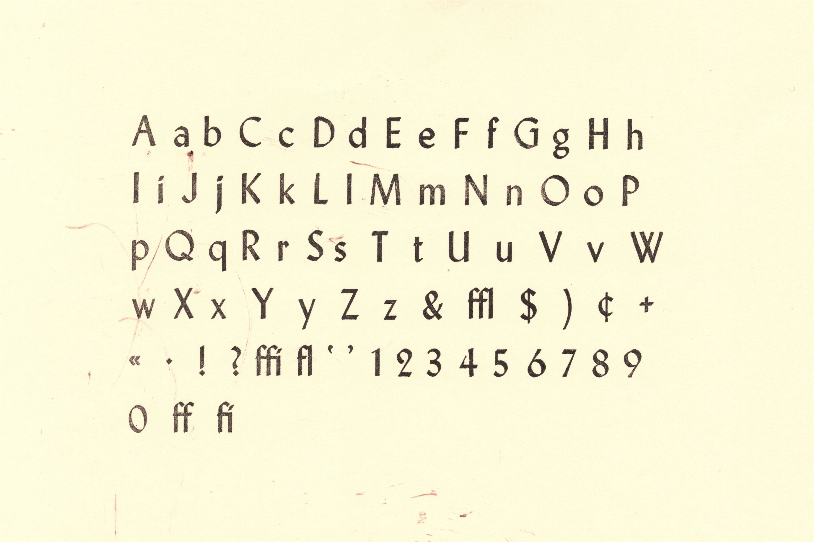

# Czarin

[Czarin](https://fontsinuse.com/typefaces/242893/czarin) is an Open Source
typeface, faithfully revived by [Jérôme
Knebusch](https://www.jeromeknebusch.net/) in 2025, commissioned by [Chad
Whitacre](https://chadwhitacre.com/). Czarin and Czarin Title were produced by
Baltimore Type & Composition Corporation about 1948, the name being derived
from the Czarnowsky family which owned the foundry. Czarin Title, issued first,
is a copy of [Offenbach](https://fontsinuse.com/typefaces/32327/offenbach)
Halbfett [Semibold], a set of pen-drawn capitals designed originally in a thin
weight by Rudolf Koch, published 1937 posthumously by the Klingspor foundry in
Germany. Czarin has minor changes in a few characters, but adds a lowercase,
designed by Edwin W. Shaar, that is different from that of Steel. In
[Stahl](https://fontsinuse.com/typefaces/32322/stahl), as named in Germany,
Koch's student Hans Kuehne added roman lowercases to the capitals of Offenbach,
published in 1939 by Klingspor.

This repository follows the [Google Fonts upstream repository
structure](https://googlefonts.github.io/gf-guide/upstream.html).

## Legal

Copyright &copy; 2025, [Jérôme Knebusch](https://www.jeromeknebusch.net/).

Licensed under the [SIL Open Font Licence (OFL 1.1)](OFL.txt).
